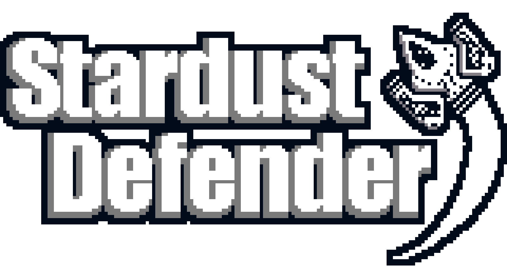
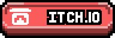
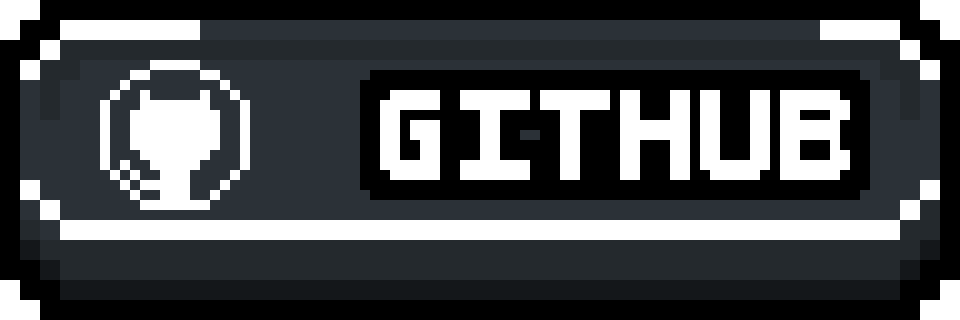

	

# Stardust Defender

Welcome to the exciting world of **Stardust Defender!** This is a **Shoot-Em-Up** game where you take control of a spaceship with the mission to exterminate malicious aliens and free space from their evil presence.

With engaging and straightforward gameplay, you will embark on an endless journey, facing dozens of waves of aliens until you reach the universe's major threats, known as "bosses." These challenges will test the skills you acquire throughout the game.

## Description

Stardust Defender unfolds in a space setting with infinite and procedural gameplay. Each enemy in the game is carefully selected and randomly positioned at the beginning of each level. Furthermore, players can acquire enhancements that strengthen them as they progress in the game.

Your sole objective is to survive as long as possible, facing threats in space. Get ready for an exciting and challenging journey!

## Screenshots

	

# Download

You can find the latest versions of the game for download on the following platforms:

# Requirements

## DirectX (Version)
- DirectX 10.0 or higher;
- .NET Runtime.

## OpenGL (Version)
- OpenGL 2.0 or higher;
- .NET Runtime.

# Documentation

If you want to understand how the code works, check out the [Project Wiki](LINK_TO_WIKI) (under construction).

# Compilation/Building

To learn how to compile the project with all the assets, refer to the [Compilation Articles in the Wiki](LINK_TO_WIKI) (under construction).

# Changelog

To find out more about the game's changelog, consult the [Changelog](CHANGELOG.md) file.

# Frequently Asked Questions

Have a question about the project? Check the [F.A.Q.](FAQ.md) (under construction) to see if it has already been answered!

# Contributions

For more information on how to contribute to the project, [click here](CONTRIBUTING.md) (under construction).

# Code of Conduct

For more information regarding our code of conduct, [click here](CODE_OF_CONDUCT.md) (under construction).

# Credits

For more details about the credits, [click here](CREDITS.md).

# Licenses

This project is under the MIT license. See the [LICENSE](LICENSE.txt) file for more details.
